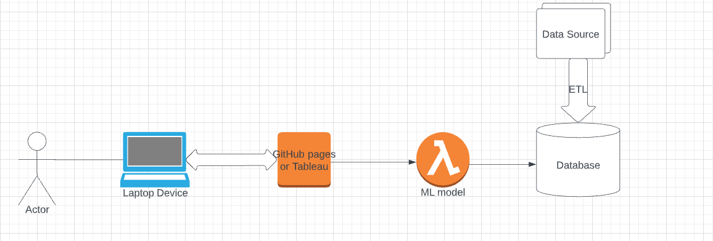

# Methane_emissions_analysis
Final Project Data Analysis and Visualization Bootcamp

### Communication protocols

- Group #3 meets up on Tuesdays, Thursdays, Fridays and Saturdays at 7pm. 
- All the communication is held via Slack
- In case of an urgent question text to personal phone numbers of  team members.

## Overview of the project

This project is created to analyze greenhouse gas emissions of different countries and sectors (agriculture, industrial processes, fugitive emissions, waste etc.).

### Lucidchart

### Data source

[Kaggle data link](https://www.kaggle.com/datasets/kkhandekar/methane-emissions-across-the-world-19902018)

[The World Bank](https://data.worldbank.org/indicator/NY.GDP.MKTP.CD)

### Key questions to be answered:

- Is there a relationship between methane emissions and GDP of the countries?
- What countries methane emissions have steadily declined over the last five years?
- Is there a relationship between methane emissions and energy consumption?

## Data Cleaning Process for ML with Python
## Identify & Drop Unused Columns 
* Methane data: two columns (gas & unit) were identified and dropped from the data-set.
* GDP data: two columns (indicator name & indicator code) were identified and dropped from the data-set.

## Drop Missing Data
* Drop missing data for both Methane and GDP data-set.

## Remove Countries That Have No Emission Values 
Drop rows with countries that don't have emission data or both Methane and GDP data (with corrected country names.

## Remove Countries That Have Different Spelling in Both Methane and GDP data
Create a list of countries with corrected spelling for all countries.

## Transpose Data

## Data Correlation Between Values

## Merge DatFrames

## Target Variable
Apply the Variance threshold to the raw dataset.
* set up our target variable and features
* Initiate linear model
* Prediction

