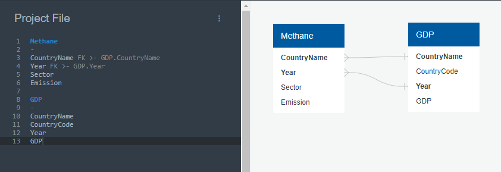
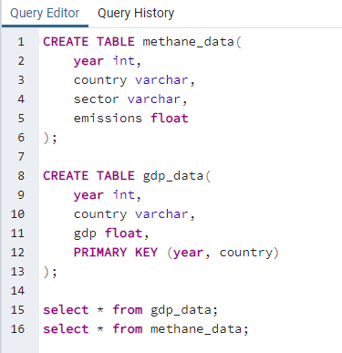
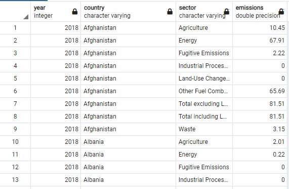
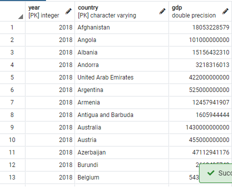
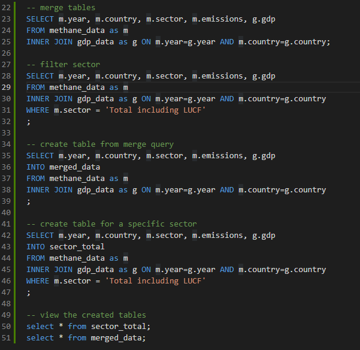
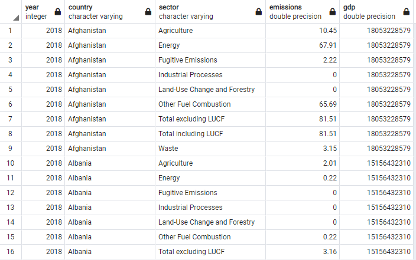
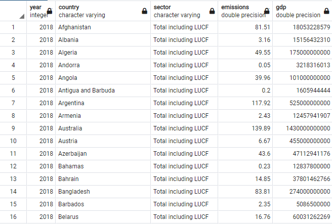
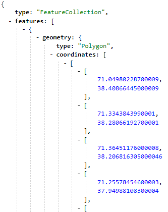
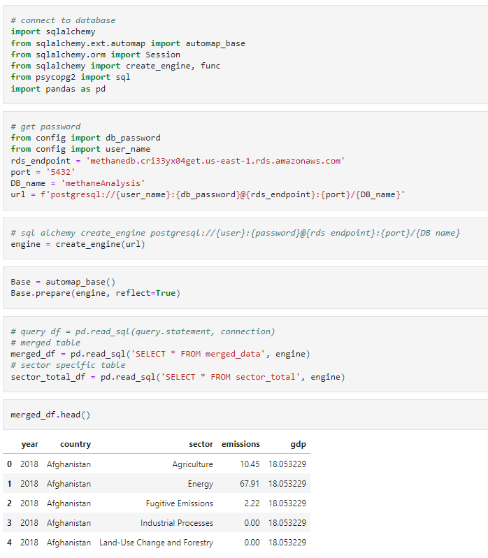

# Database

An AWS RDS database was created and connected to Postgres.

## ERD 
[ERD Link](https://app.quickdatabasediagrams.com/#/d/H3orn0)

## Two tables were created in PgAdmin and the data was imported into the tables

### Query

### Methane_data table

### GDP_data table

## The tables were then joined using an inner join and two new tables were created

### Query

- The tables were joined using an inner join
- The merged_data table was created to hold the joined query data
- The two tables were joined and then filtered for a specific sector
- A new table was created to store the filtered data

### Merged Data table

- This table will be used to identify the relationship between emissions and gdp for every sector.

### Sector Specific Data table

- This table can be used to view the total emissions of each country and their GDP

## S3 Bucket

An S3 Bucket was created to store our Geojson data.

- Snippet of the Geojson file used for mapping of the data

## Connecting the Database to the python

- SQLAlchemy was used to connect to the database in python to use the tables in the machine learning model
