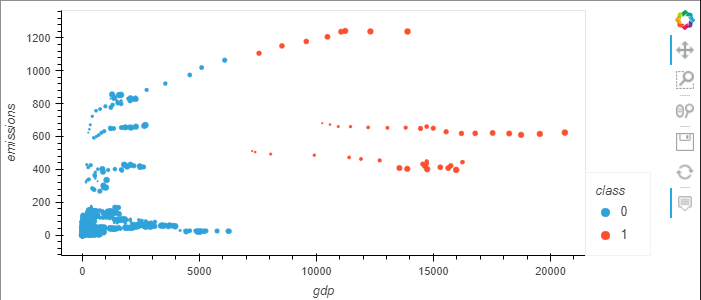
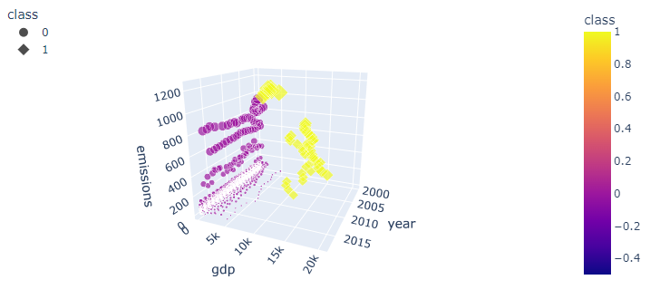
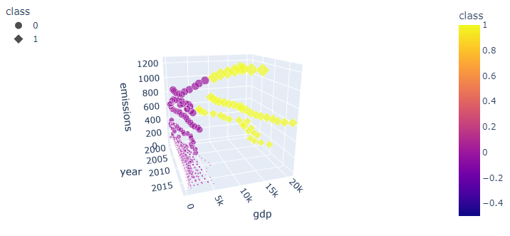
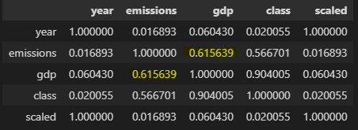

# Machine Learning Models

## Questions to Answer
1. Is there a relationship between methane emission and GDP?
2. When GDP is higher, does gas emissions go up, down, or not related?
3. Can previous GDP and Emissions data help predict future methane emissions?

## ML Model

Libraries used:
- Plotly
- hvPlot

### Null Hypothesis

There is no relation between GDP and emissions. 

## Analysis

### Setting up the data

- The dataframe we used inlcuded year, country, gdp, emissions columns
- The sector column was filtered for only the total data for emissions. We did this because the GDP data was connected to the countries and was therefore repeated for every secto skewing model.

- The country and sector column were dropped from the dataframe because the values were not numerical
- We tried get_dummies for the country column but did not get any valuable use of the column

### Determine K

- The best fit k was determined by an Elbow Curve plotted by hvPlot

### The Model

#### hvPlot model

- Two clusters formed
- Class 1 inludes GDP data over 7000 and Emisions data over 375
- The top line of dots represents China over the years

#### 3D Model

- The 3D model allow us to visulaize the data through the years

#### Correlation

- GDP and emissions have the highest correlation of about 62%

## Challenges

The model was very difficult to manipulate. We tried many different variations of manipulating the data to try and influence the model. 

For example:
1. We added a column dividing emissions and gdp. We then removed emissions adn gdp from the dataframe
2. The year column was scaled and/or categorized 
3. Get_dummies was used on the country column
4. The country and sector columns were categorized before using get_dummies
5. We used a dataframe with all the sectors minus the total sector (and tried all of the above again)
etc...

We also tried a Linear Regression model to no avail.

All of these efforts did not provide any further insight than the model above. 

## Conclusion

We were not able to prove that a machine learning could be used to replicate the data. However, the model could not disprove our null hypthosis. There is a correlation between GDP and emissions. It is clear in the model that over time, as GDP increases so do Emissions. 

More data would help 
