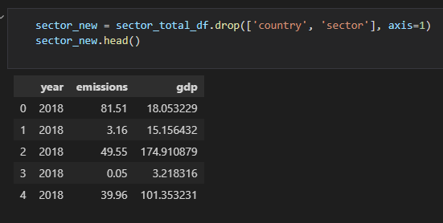
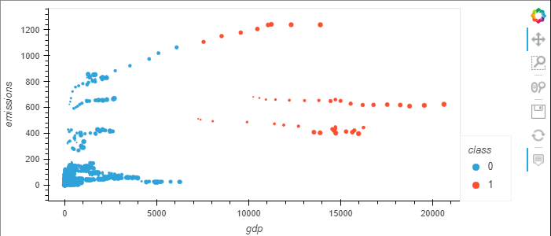
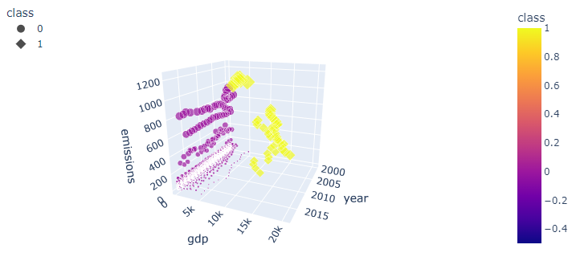
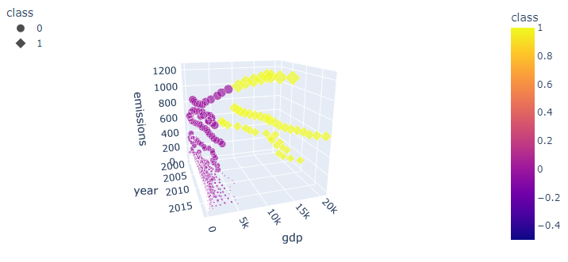
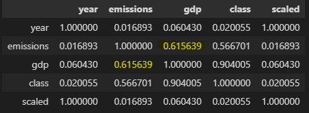

### Roles
* Front End/ Dashboard: Oxana
* Dashboard/ ETL: Samira
* Database, ML model: Rachel
* Readme, Tableau: Grace

## Overview of the project

This project is created to analyze greenhouse gas emissions of different countries and sectors (agriculture, industrial processes, fugitive emissions, waste etc.) and finding if there is a correlation between GDP of the country and its methane emission.

### Lucidchart

### Data source

[Kaggle data link](https://www.kaggle.com/datasets/kkhandekar/methane-emissions-across-the-world-19902018)

[The World Bank](https://data.worldbank.org/indicator/NY.GDP.MKTP.CD)

[Countryeconomy.com/gdp]( https://countryeconomy.com/gdp)

### Key question to be answered:

- Is there a correlation between methane emissions and GDP of the countries?

## Technical Description

Some of the libraries and tools that will include: Pandas, PostgresSQL, AWS, ML, JavaScript, html, plotly, Scikit.learn. hvPlot, Excel, Tableau, Lucid-chart, etc. We can look into some statistical models to see the relationship between them, i.e. they may have the same increasing or decreasing factor variable.

Anticipated major challenges 

* Original GDP dataset was represented in scientific notation with large numbers. Now the numbers are repreesented in billions. We had to convert in excel. 
* Pivoting and finding a new dataset on a short notice.
* Be cautious during the data transformation not change the raw dataset.
* Having patience with each other as a team can be hard. Thus, we will need to be intentional on distributing responsibilities so that there are no duplication of efforts and meeting times that work for the team. 

# ETL process

###### The World GDP Data.xls was changed manually:

- First three rows have been deleted since they had no valuable information for the analysis and didn't let pandas read in the table as a readable dataframe
- European Union was changed to European Union (27) to match its name in methane_hist_emissions.csv

###### Read in methane emissions and GDP Data CVSs to pandas

- Drop unused columns from both dataframes
- Compare countries names from both dataframes
- Correct spelling of some countries in both dataframes so they match
- Check null values in both dataframes

- Data from 1990-1999 was dropped because of a lot of missing values in this period of time leaving nineteen years of data for the analysis.
- Missing GDP Data for some countries for 2000-2018  years was added manually instead of using .fillna() to keep the results of the analysis accurate.
- South Sudan was excluded from analysis because it gained independence from Sudan in 2011, therefore there is no GDP data available before this time.
- GDP data was normalized by dividing by 1 000 000 000
- Keep only matching countries in both dataframes
- Transpose and merge the dataframes
- Export new GDP, emissions, and merged dataframes as .csv files.

# Machine Learning Models

## Questions to Answer
1. Is there a relationship between methane emission and GDP?
2. When GDP is higher, does gas emissions go up, down, or not related?
3. Can previous GDP and Emissions data help predict future methane emissions?

## ML Model

Libraries used:
- Plotly
- hvPlot

### Null Hypothesis

There is no relation between GDP and emissions. 

## Analysis

### Setting up the data

- The dataframe we used inlcuded year, country, gdp, emissions columns
- The sector column was filtered for only the total data for emissions. We did this because the GDP data was connected to the countries and was therefore repeated for every secto skewing model.

- The country and sector column were dropped from the dataframe because the values were not numerical
- We tried get_dummies for the country column but did not get any valuable use of the column

### The Model

#### hvPlot model

- Two clusters formed
- Class 1 inludes GDP data over 7000 and Emisions data over 375
- The top line of dots represents China over the years

#### 3D Model

- The 3D model allow us to visulaize the data through the years

#### Correlation

- GDP and emissions have the highest correlation of about 62%

## Challenges

The model was very difficult to manipulate. We tried many different variations of manipulating the data to try and influence the model. 

For example:
1. We added a column dividing emissions and gdp. We then removed emissions adn gdp from the dataframe
2. The year column was scaled and/or categorized 
3. Get_dummies was used on the country column
4. The country and sector columns were categorized before using get_dummies
5. We used a dataframe with all the sectors minus the total sector (and tried all of the above again)
etc...

We also tried a Linear Regression model to no avail.

All of these efforts did not provide any further insight than the model above. 

## Conclusion

We were not able to prove that a machine learning could be used to replicate the data. However, the model could not disprove our null hypthosis. There is a correlation between GDP and emissions. It is clear in the model that over time, as GDP increases so do Emissions. The correlation between emissions and gdp also confirms this.

Further Analysis:
1. More data could be beneficial in poviding a more adequate machine learning model. For example: Population data over the years for each country.
2. Knowledge of climatae change iniatives. This information would be valuable in studying emissions over time for each country

# Database

An AWS RDS database was created and connected to Postgres.

## ERD 
[ERD Link](https://app.quickdatabasediagrams.com/#/d/H3orn0)

## Two tables were created in PgAdmin and the data was imported into the tables

### Query

### Methane_data table

### GDP_data table

## The tables were then joined using an inner join and two new tables were created

### Query

- The tables were joined using an inner join
- The merged_data table was created to hold the joined query data
- The two tables were joined and then filtered for a specific sector
- A new table was created to store the filtered data

### Merged Data table

- This table will be used to identify the relationship between emissions and gdp for every sector.

### Sector Specific Data table

- This table can be used to view the total emissions of each country and their GDP

## S3 Bucket

An S3 Bucket was created to store our Geojson data.

- Snippet of the Geojson file used for mapping of the data

## Connecting the Database to python

- SQLAlchemy was used to connect to the database in python to use the tables in the machine learning model

# Front End

- Build a GitHub page as a dashboard for the project (HTML, CSS, JavaScript) including some information about methane, a map showing GDP, methane emissions, and a ratio emissions/GDP for each country
- Using Tableau to get a better visualization for the final GitHub page.

## References

- statista (2022). Venezuela: Growth rate of the real gross domestic product (GDP) from 2012 to 2022. Retrieved from [https://countryeconomy.com/gdp/venezuela](https://countryeconomy.com/gdp/venezuela#:~:text=The%20GDP%20figure%20in%202018,2017%2C%20when%20it%20was%20%244%2C892.)

- Country Economy(2022). Nauru GDP.  Retrieved from [https://countryeconomy.com/gdp/nauru?year=2010](https://countryeconomy.com/gdp/nauru?year=2010) 

- Country Economy(2022). Eritrea GDP.  Retrieved from [https://countryeconomy.com/gdp/eritrea](https://countryeconomy.com/gdp/eritrea)
- Country Economy(2022). Somalia GDP.  Retrieved from [https://countryeconomy.com/gdp/Somalia?year=2010](https://countryeconomy.com/gdp/Somalia?year=2010)
- Country Economy(2022). Afghanistan GDP.  Retrieved from [https://countryeconomy.com/gdp/afghanistan](https://countryeconomy.com/gdp/afghanistan?year=2001#:~:text=The%20GDP%20figure%20in%202001,2000%2C%20when%20it%20was%20%24170.)
- Country Economy(2022). Sao Tome GDP.  Retrieved from [https://countryeconomy.com/gdp/sao-tome-principe?year=2005](https://countryeconomy.com/gdp/sao-tome-principe?year=2005)

