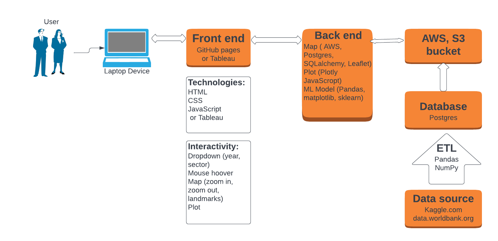

## Communication protocols

- Group #3 meets up on Tuesdays and Thursdays  at 7pm via zoom. 
- All the communication is held via Slack
- In case of an urgent question text to personal phone numbers of  team members.

### Roles
* Front End/ Dashboard: Oxana
* Dashboard/ ETL: Samira
* Database, ML model: Rachel
* Readme, Tableau: Grace

## Overview of the project

This project is created to analyze greenhouse gas emissions of different countries and sectors (agriculture, industrial processes, fugitive emissions, waste etc.) and finding if there is a correlation between GDP of the country and its methane emission.

### Lucidchart

### Data source

[Kaggle data link](https://www.kaggle.com/datasets/kkhandekar/methane-emissions-across-the-world-19902018)

[The World Bank](https://data.worldbank.org/indicator/NY.GDP.MKTP.CD)

[Countryeconomy.com/gdp]( https://countryeconomy.com/gdp)

### Key question to be answered:

- Is there a correlation between methane emissions and GDP of the countries?

## Technical Description

Some of the libraries and tools that will include: Pandas, PostgresSQL, AWS, ML, JavaScript, html, plotly, Scikit.learn. hvPlot, Excel, Tableau, Lucid-chart, etc. We can look into some statistical models to see the relationship between them, i.e. they may have the same increasing or decreasing factor variable.

Anticipated major challenges 

* Original GDP dataset was represented in scientific notation with large numbers. Now the numbers are repreesented in billions. We had to convert in excel. 
* Pivoting and finding a new dataset on a short notice.
* Be cautious during the data transformation not change the raw dataset.
* Having patience with each other as a team can be hard. Thus, we will need to be intentional on distributing responsibilities so that there are no duplication of efforts and meeting times that work for the team. 

#### ETL process

###### The World GDP Data.xls was changed manually:

- First three rows have been deleted since they had no valuable information for the analysis and didn't let pandas read in the table as a readable dataframe
- European Union was changed to European Union (27) to match its name in methane_hist_emissions.csv

###### Read in methane emissions and GDP Data CVSs to pandas

- Drop unused columns from both dataframes
- Compare countries names from both dataframes
- Correct spelling of some countries in both dataframes so they match
- Check null values in both dataframes

- Data from 1990-1999 was dropped because of a lot of missing values in this period of time leaving nineteen years of data for the analysis.
- Missing GDP Data for some countries for 2000-2018  years was added manually instead of using .fillna() to keep the results of the analysis accurate.
- South Sudan was excluded from analysis because it gained independence from Sudan in 2011, therefore there is no GDP data available before this time.
- GDP data was normalized by dividing by 1 000 000 000
- Keep only matching countries in both dataframes
- Transpose and merge the dataframes
- Export new GDP, emissions, and merged dataframes as .csv files.

#### Machine Learning model

- Load in the data to Pandas
- Use elbow-curve to find the k
- Use K-means clustering algorithm
- Use hvscatter and scatter3D plot to visualize the clusters.

#### Database

- Transpose GDP and Emissions CSV files 

- Load the files to SQL tables
- Merge those tables
- Connect Postgres to AWS

#### Front End

- Build a GitHub page as a dashboard for the project (HTML, CSS, JavaScript) including some information about methane, a map showing GDP, methane emissions, and a ratio emissions/GDP for each country
- Using Tableau to get a better visualization for the final GitHub page.

## References

- statista (2022). Venezuela: Growth rate of the real gross domestic product (GDP) from 2012 to 2022. Retrieved from [https://countryeconomy.com/gdp/venezuela](https://countryeconomy.com/gdp/venezuela#:~:text=The%20GDP%20figure%20in%202018,2017%2C%20when%20it%20was%20%244%2C892.)

- Country Economy(2022). Nauru GDP.  Retrieved from [https://countryeconomy.com/gdp/nauru?year=2010](https://countryeconomy.com/gdp/nauru?year=2010) 

- Country Economy(2022). Eritrea GDP.  Retrieved from [https://countryeconomy.com/gdp/eritrea](https://countryeconomy.com/gdp/eritrea)
- Country Economy(2022). Somalia GDP.  Retrieved from [https://countryeconomy.com/gdp/Somalia?year=2010](https://countryeconomy.com/gdp/Somalia?year=2010)
- Country Economy(2022). Afghanistan GDP.  Retrieved from [https://countryeconomy.com/gdp/afghanistan](https://countryeconomy.com/gdp/afghanistan?year=2001#:~:text=The%20GDP%20figure%20in%202001,2000%2C%20when%20it%20was%20%24170.)
- Country Economy(2022). Sao Tome GDP.  Retrieved from [https://countryeconomy.com/gdp/sao-tome-principe?year=2005](https://countryeconomy.com/gdp/sao-tome-principe?year=2005)

